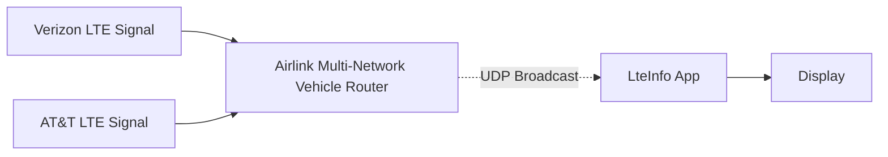

# airlinkinfo - Display Airlink data acquired from UDP broadcasts to screen

This program (named) was developed for the [IEEE MOVE project](https://https://move.ieee.org).

The program receives UDP broadcast packets from [Airlink MG90](https://www.sierrawireless.com/products-and-solutions/routers-gateways/mg90/) and 
displays them to screen.

